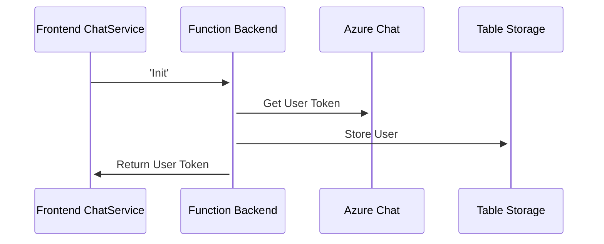
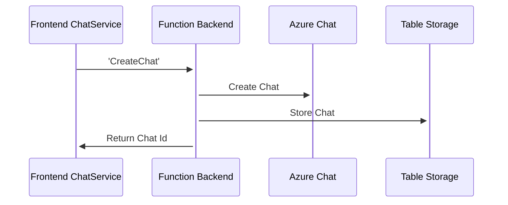
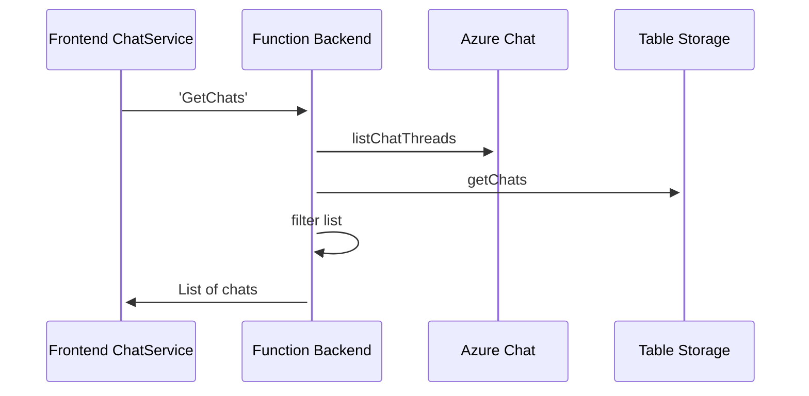
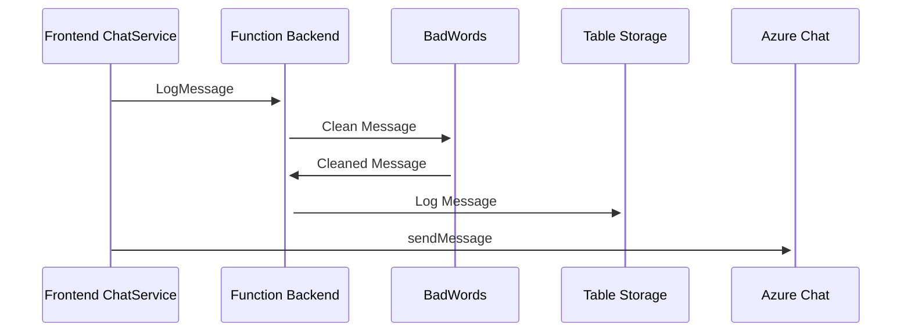
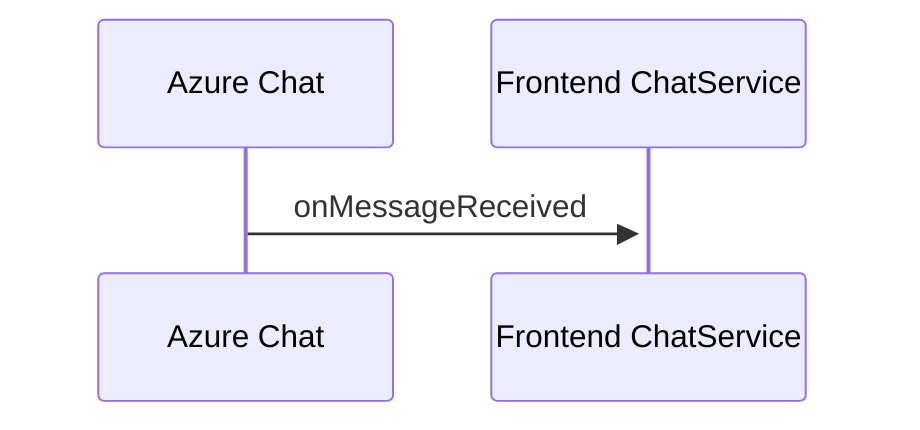

# ChadChatBackend - Azure Function

## Project Overview

This is the front end component that goes with the backend component. Combined these create a very simple chat application. Both of these can be ran together on your machine to give you a simple chat application.

## API

### Backend API

All calls but 'Init' assume Token (azure chat), userId, and userEmail are passed through headers.

- Init
  - POST /api/Init
- CreateChat
  - POST /api/CreateChat
- GetChats
  - GET /api/GetChats
- LogMessage
  - POST /api/LogMessage

## Project Tech Overview

Project was built using the Azure Function ClI (func). This project is a NodeJS (18+) project.

This project is the backend that hosts calls for the frontend services.

### Development server

Run `func start` for a dev server. This will run you endpoints on the default Azure Function Port 7071.

You can also run this directly from within VS Code.

## Table Storage

This project uses Azure Table Storage to store chat related information. It requires three tables to exist.

- users
- threads
- messages

The users table stores basic information about a user. It contains the user's email address and their azure communication user id.

The threads table contains information about each chat thread. Each chat thread is duplicated in this table multiple times. There will be one copy of the chat thread for each member of the chat. The duplication of data is done to make searching chats by user faster. Listing all chats for a given user is just a query by primary key of the table.

The message table holds chat messages. No duplication is done here. This is only done ofr logging purposes.

## Configuration

To run this locally you should create a local.settings.json file. All of the values listed below MUST be provided. You can use emulator storage (azurite) for the storage account connection string. But you MUST use an Azure Communication Services Connection string for Chat.

```JSON
{
    "IsEncrypted": false,
    "Values": {
      "AzureWebJobsStorage": "UseDevelopmentStorage=true",
      "FUNCTIONS_WORKER_RUNTIME": "node",
      "AzureWebJobsFeatureFlags": "EnableWorkerIndexing",
      "ChatConnectionString": "<YOUR CHAT CONNECTION STRING HERE>",
      "ChatConnectionStringEndpoint": "<YOUR CHAT ENDPOINT HERE",
      "TableStorageConnectionString": "UseDevelopmentStorage=true"
    },
    "Host": {
      "LocalHttpPort": 7071,
      "CORS": "*"
    }
}

```

## Azure CLI Quick Help / Deployment

```
az account tenant list
az login --tenant <your tenant id>
```

```
func azure functionapp publish <Azure Function Name>
```

## Companion Frontend

Link: https://github.com/chadmichel/ChadChatAngular

## Chat Sequence Diagrams

1. Init



2. Create Chat



3. Get Chat



4. Send Messages



5. Receive Messages



## Related Blog Post Series

[Part 1 - Angular Setup](https://dontpaniclabs.com/blog/post/2023/04/27/building-a-chat-system-part-1/)

[Part 2 - Azure Chat](https://dontpaniclabs.com/blog/post/2023/05/09/building-a-chat-system-part-2/)
